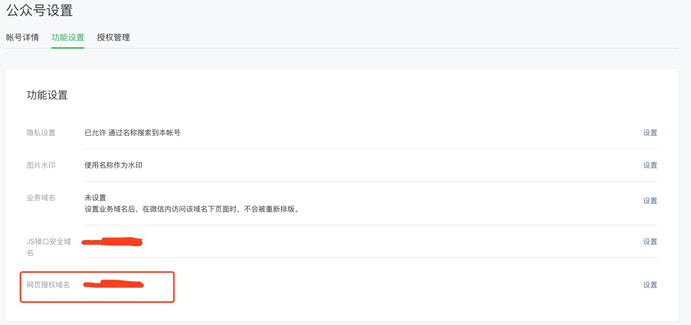
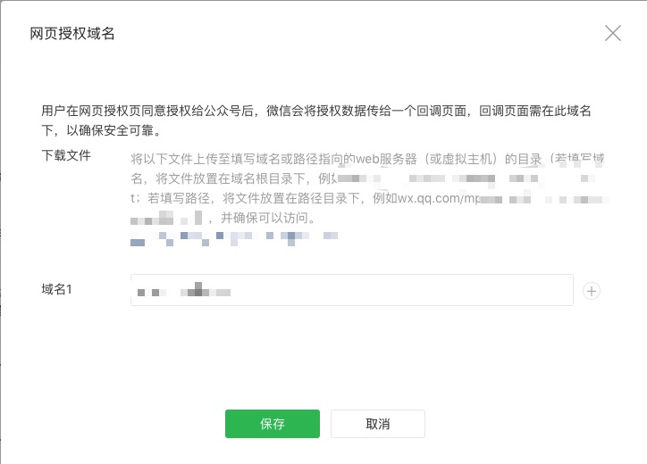
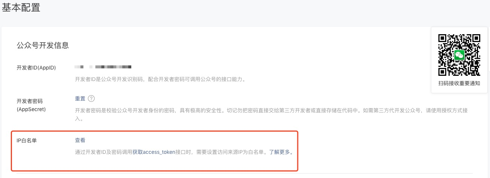
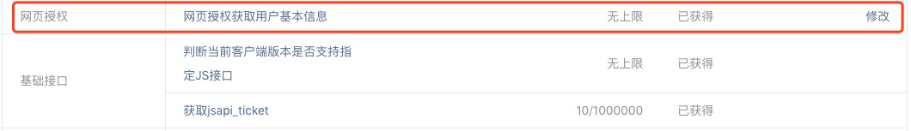
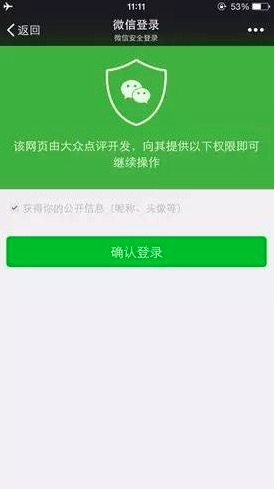
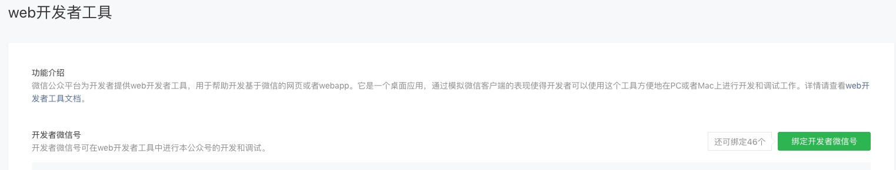
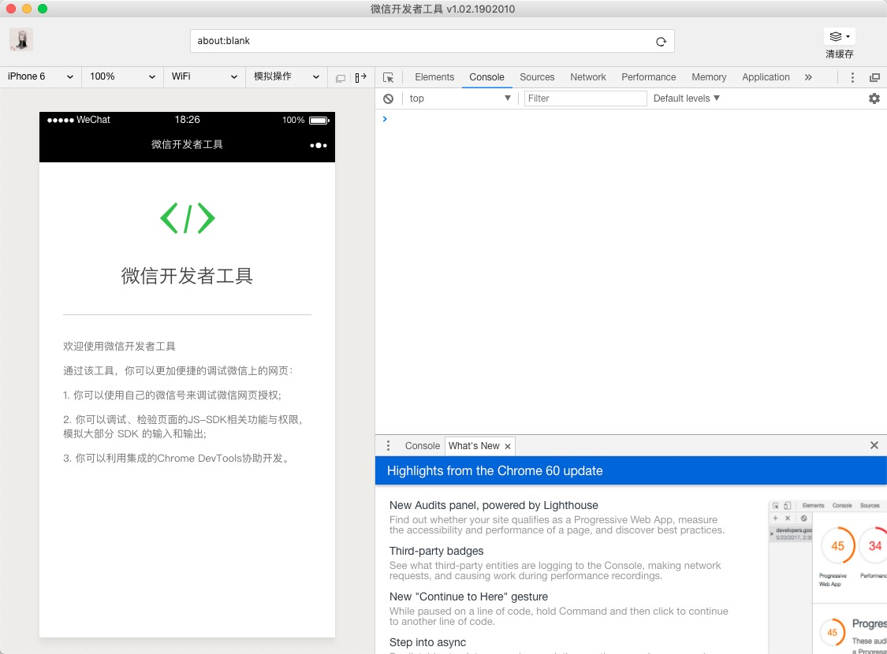

# 微信公众号开发之获取用户信息及其openId流程

> openId及其unionId主要用于h5页面在微信浏览器中的自动登录，小程序、公众号、web站及其app的账号互通

## 概念 

**openId:** 当用户关注微信公众号以后，用户与该公众号会产生唯一标示。每个用户对每个公众号的OpenID是唯一的，对于不同公众号，同一用户的OpenID不同。(小程序同理)

**unionId:** 同一个微信开放平台帐号下的移动应用、网站应用和公众帐号，用户的UinonID是唯一的。当开发者拥有多个公众号或应用时，同使用UinonID来确保账号的唯一性

## 准备工作

### 1.申请开通微信服务号/订阅号

### 2.对公众平台进行配置

#### 2-1.将网站域名加入网页授权域名

添加安全域名微信要对该域名做校验，需要将微信分配的xxx.txt文件放到网站服务器保证微信能够访问到该文件

#### 2-2.将网站IP地址加入IP白名单,记录appId和appSecret

#### 2-3.确认该公众号的网页授权获取用户基本信息权限开通

开发下面的接口权限处查看

## 获取openId及其unionId流程

### 1.获取code码

诱导用户打开微信提供的链接https://open.weixin.qq.com/connect/oauth2/authorize?appid=APPID&redirect_uri=REDIRECT_URI&response_type=code&scope=SCOPE&state=STATE#wechat_redirect

参数说明

<table><thead><tr><th>参数</th><th>是否必须</th><th>说明</th></tr></thead><tbody><tr><td>appid</td><td>是</td><td>公众号的唯一标识</td></tr><tr><td>redirect_uri</td><td>是</td><td>授权后重定向的回调链接地址， 请使用 urlEncode 对链接进行处理</td></tr><tr><td>response_type</td><td>是</td><td>返回类型，请填写code</td></tr><tr><td>scope</td><td>是</td><td>应用授权作用域，snsapi_base （不弹出授权页面，直接跳转，只能获取用户openid），snsapi_userinfo （弹出授权页面，可通过openid拿到昵称、性别、所在地。并且， 即使在未关注的情况下，只要用户授权，也能获取其信息 ）</td></tr><tr><td>state</td><td>否</td><td>重定向后会带上state参数，开发者可以填写a-zA-Z0-9的参数值，最多128字节</td></tr><tr><td>#wechat_redirect</td><td>是</td><td>无论直接打开还是做页面302重定向时候，必须带此参数</td></tr></tbody></table>

分为静默授权和用户手动授权，静默授权用户无法察觉，手动授权会弹出如下页面，需要用户手动允许

链接重定向后的query自动附加code码（code码的有效期为5分钟）

### 2.用code码换取access_token和openId

请求微信链接 https://api.weixin.qq.com/sns/oauth2/access_token?appid=APPID&secret=SECRET&code=CODE&grant_type=authorization_code

参数说明

<table><thead><tr><th>参数</th><th>是否必须</th><th>说明</th></tr></thead><tbody><tr><td>appid</td><td>是</td><td>公众号的唯一标识</td></tr><tr><td>secret</td><td>是</td><td>公众号的appsecret</td></tr><tr><td>code</td><td>是</td><td>填写第一步获取的code参数</td></tr><tr><td>grant_type</td><td>是</td><td>填写为authorization_code</td></tr></tbody></table>

返回值 

<table><thead><tr><th>参数</th><th>描述</th></tr></thead><tbody><tr><td>access_token</td><td>网页授权接口调用凭证,注意：此access_token与基础支持的access_token不同</td></tr><tr><td>expires_in</td><td>access_token接口调用凭证超时时间，单位（秒）</td></tr><tr><td>refresh_token</td><td>用户刷新access_token</td></tr><tr><td>openid</td><td>用户唯一标识，请注意，在未关注公众号时，用户访问公众号的网页，也会产生一个用户和公众号唯一的OpenID</td></tr><tr><td>scope</td><td>用户授权的作用域，使用逗号（,）分隔</td></tr></tbody></table>

其中的refresh_token可以用来刷新并获取access_token（access_token有效期2小时，refresh_token有效期30天）

### 3.用access_token和openId获取用户信息及其unionId （只有手动授权的的方式获取的access_token才能获取用户信息）

请求链接 https://api.weixin.qq.com/sns/userinfo?access_token=ACCESS_TOKEN&openid=OPENID&lang=zh_CN

参数说明

<table><thead><tr><th>参数</th><th>描述</th></tr></thead><tbody><tr><td>access_token</td><td>网页授权接口调用凭证,注意：此access_token与基础支持的access_token不同</td></tr><tr><td>openid</td><td>用户的唯一标识</td></tr><tr><td>lang</td><td>返回国家地区语言版本，zh_CN 简体，zh_TW 繁体，en 英语</td></tr></tbody></table>

返回值

<table><thead><tr><th>参数</th><th>描述</th></tr></thead><tbody><tr><td>openid</td><td>用户的唯一标识</td></tr><tr><td>nickname</td><td>用户昵称</td></tr><tr><td>sex</td><td>用户的性别，值为1时是男性，值为2时是女性，值为0时是未知</td></tr><tr><td>province</td><td>用户个人资料填写的省份</td></tr><tr><td>city</td><td>普通用户个人资料填写的城市</td></tr><tr><td>country</td><td>国家，如中国为CN</td></tr><tr><td>headimgurl</td><td>用户头像，最后一个数值代表正方形头像大小（有0、46、64、96、132数值可选，0代表640*640正方形头像），用户没有头像时该项为空。若用户更换头像，原有头像URL将失效。</td></tr><tr><td>privilege</td><td>用户特权信息，json 数组，如微信沃卡用户为（chinaunicom）</td></tr><tr><td>unionid</td><td>只有在用户将公众号绑定到微信开放平台帐号后，才会出现该字段。</td></tr></tbody></table>

## 本地测试

### 1.微信公众平台绑定自己的微信账号为开发者

### 2.下载微信开发工具

### 3.本地测试需要将本地的服务器端口改为80并将host文件的 127.0.0.1指向安全域名，并在微信公众平台中测试

### 4.手机微信中测试需将手机代理设置为电脑，并访问安全域名

## 参考资料

* [微信官方文档](https://mp.weixin.qq.com/wiki?t=resource/res_main&id=mp1421140842)